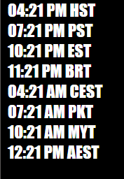

# PBMTV OBS World Clocks

### The world clocks can be used from the file browser or web hosted

### Run 'npm install' to install the necessary luxon date library or download it manually

### By default, you will receive the clocks PBMTV uses

### To use custom timezones, add the Olsen Timezone strings, separated by comma in your url string:
clocks.html?tz=Pacific/Honolulu,America/Los_Angeles

### To use your own shorthand for the timezones, use the following:
clocks.html?tz=Pacific/Honolulu,America/Los_Angeles&sh=HST,PST

### A full list of compatible timezones is available here:
https://en.wikipedia.org/wiki/List_of_tz_database_time_zones
